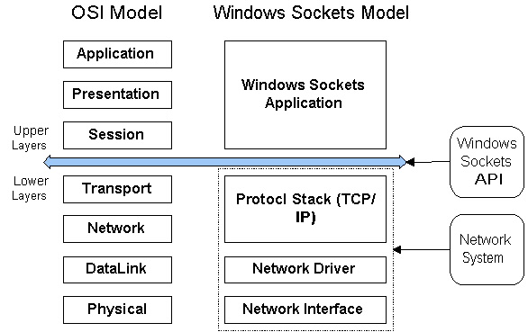
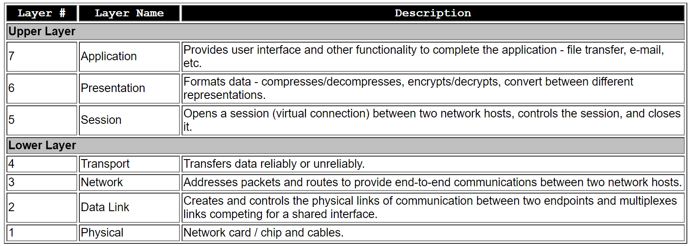
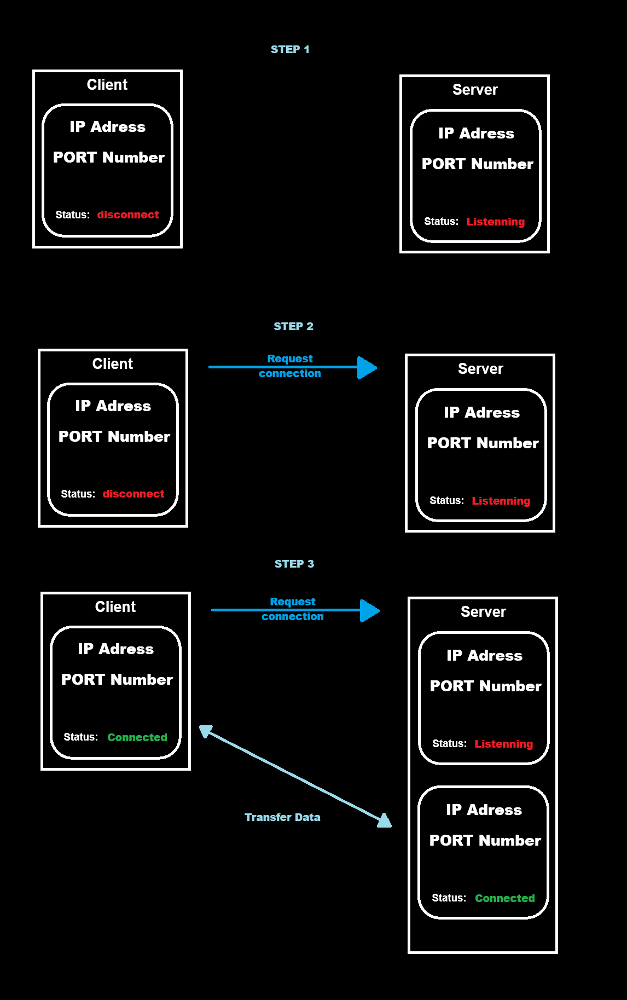

# Sockets

## What is a socket
A pipe between two computers on a network through which data flows

## Types of sockets
Streamming socket `sock_stream` - Check if the connection has been established (TCP)
Datagram socket `sock_dgram` - Don’t check if the connection has been established (UDP)


## Windows Sockets API WSA
The Windows Sockets API WSA consists of a collection of functions, data structures and conventions. WSA provides standard access to the network services of an underlying protocol stack to any Windows application.

## OSI (Open Systems Interconnect)
The Open Systems Interconnect (OSI) is a network reference model that presents an overview of all network systems. It reduces the complex subject of networking into its essential components, and illustrates how these components interact with each other in a common framework.




Note how the upper layers of the OSI model are referred to as Windows Sockets Application, while the lower layers form the Network System. The WinSock API (WSA) sits between the two. WSA provides access to the Network System, and the WinSock Applications uses WSA services to send and receive information.




# Socket Connection Steps
1. **Step 1** - Create server and client sockets.
2. **Step 2** - The client socket requests a connection to the server socket.
3. **Step 3** - The server creates a new socket to handle the client connection, while the original server socket continues to listen for new incoming requests.




## Server Functions

1. **Initialize WSA**: `WSAStartup()`
2. **Create a Socket**: `socket()`
3. **Bind the Socket**: `bind()`
4. **Listen for Connections**: `listen()`
5. **Accept a Connection**: `accept()`
6. **Send and Receive Data**: `send()`, `recv()`, `sendto()`, `recvfrom()`
7. **Disconnect**: `closesocket()`


```
// WSADATA is a structure that contains information about the Windows Sockets implementation. It will be filled with data by the WSAStartup function.
WSADATA wsaData; 

int wsaerr;

// The MAKEWORD(2, 2) macro call creates a 16-bit value representing the version of Winsock that the program is requesting (2.2 in this case)
WORD wVersionRequested = MAKEWORD(2, 2); 

//  Initialize the Winsock library
wsaerr = WSAStartup(wVersionRequested, &wsaData);

```

## Client Functions

1. **Initialize Winsock**: `WSAStartup()`
2. **Create a Socket**: `socket()`
3. **Connect to the server**: `connect()`
4. **Send and Receive Data**: `send()`, `recv()`, `sendto()`, `recvfrom()`
5. **Disconnect**: `closesocket()`


Goal: The goal of this project is to learn more about sockets with WSA (Windows sockets API)